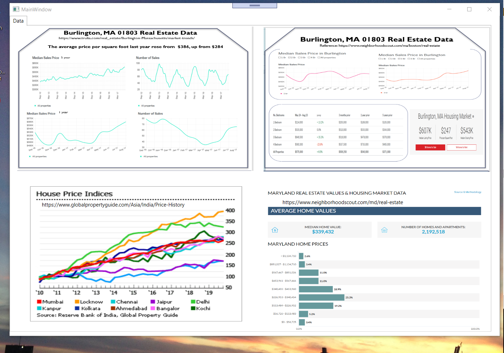
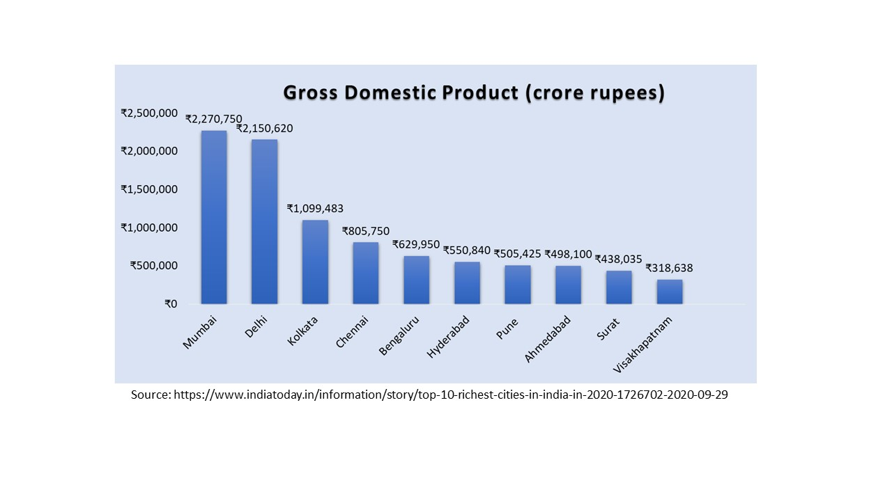

# Real Estate Portfolio

The project provides an overview of a real estate data and trends

Confidential information is not displayed. Images are custom.

Please download the executable in https://github.com/alpaddesai/RealEstatePortfolio/releases

## Real Estate Data

## Cities by Gross Domestic Product

## Property Law in UK

Related topics include: https://github.com/alpaddesai/Sales,  https://github.com/alpaddesai/FinancialAdvice, https://github.com/alpaddesai/BenefitsOfFitnessRoutine, https://github.com/alpaddesai/HealthBenefitsOfTraveling, https://github.com/alpaddesai/BenefitsofMoving, https://github.com/alpaddesai/EarlyChildHoodEducation , https://github.com/alpaddesai/BenefitsOfLivingAbroad, https://github.com/alpaddesai/ElderlyCare, https://github.com/alpaddesai/OptimalCapitalStructure , https://github.com/alpaddesai/PowerandInfluentialSkills, https://github.com/alpaddesai/HealthCare , https://github.com/alpaddesai/SocialNetworking and  https://github.com/alpaddesai/CreatingandLeadingEffectiveOrganizations.

